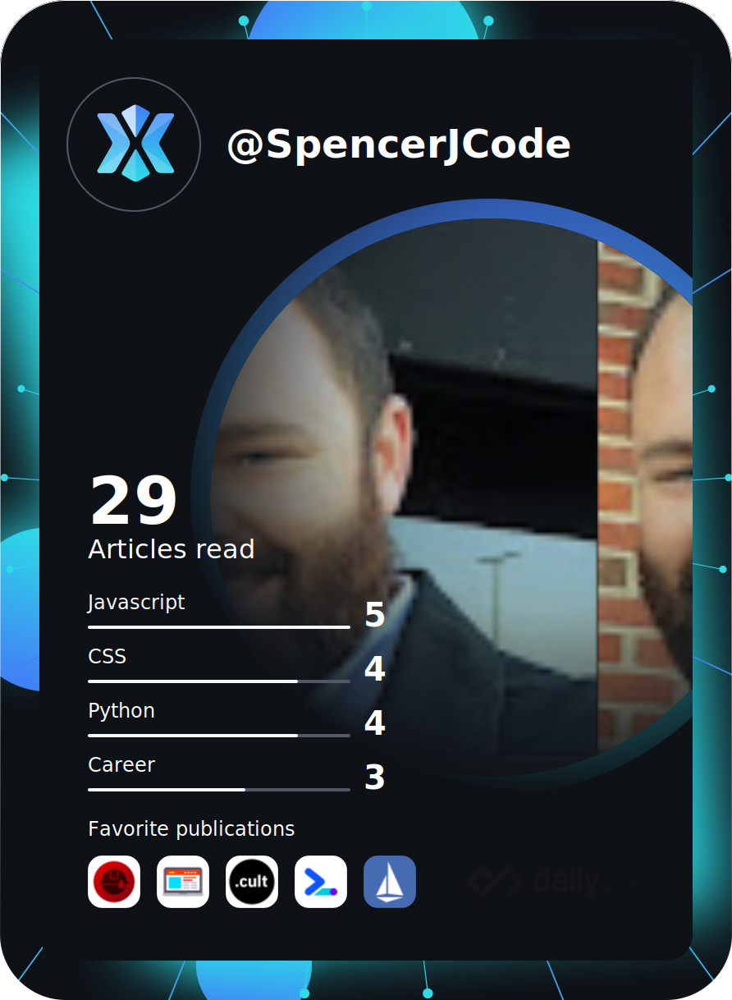
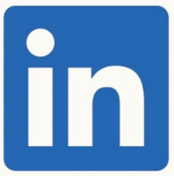
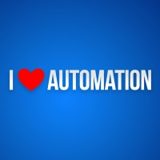
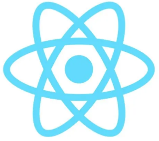
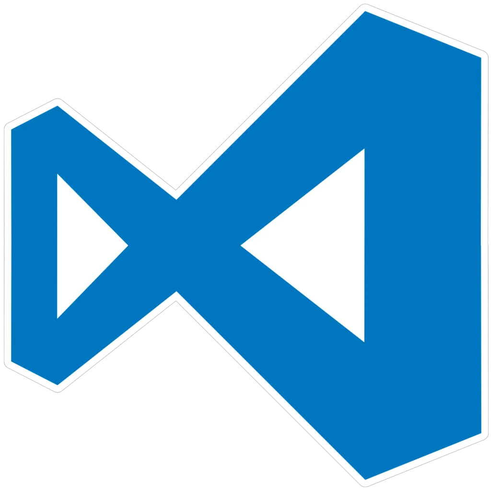
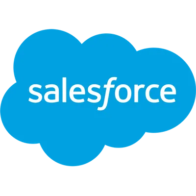
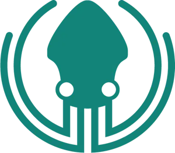
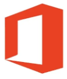
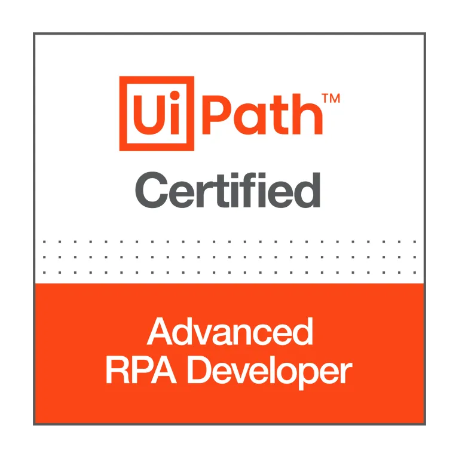

<h2>Media Presence</h2>

<h2>Tech Skills</h2>

<h2>Tools and Apps</h2>

<h2>Professional Certifications</h2>

📫 How to reach me: spencerjcode@gmail.com

🥋 Enrolled in <a href=https://www.codingdojo.com>Coding Dojo</a>, est. graduation early June

🌱 Currently learning about AI integration with RPA/Software development

❤️ Passionate about building tools that solve problems and help people

✝️ Reformed Baptist Christian, bringing excellence in character and integrity to the workplace

⚡ Fun fact: There was a time in my life where I was floating in the open ocean and being circled by a shark

💼 Looking for full-time employment in RPA/Software development

